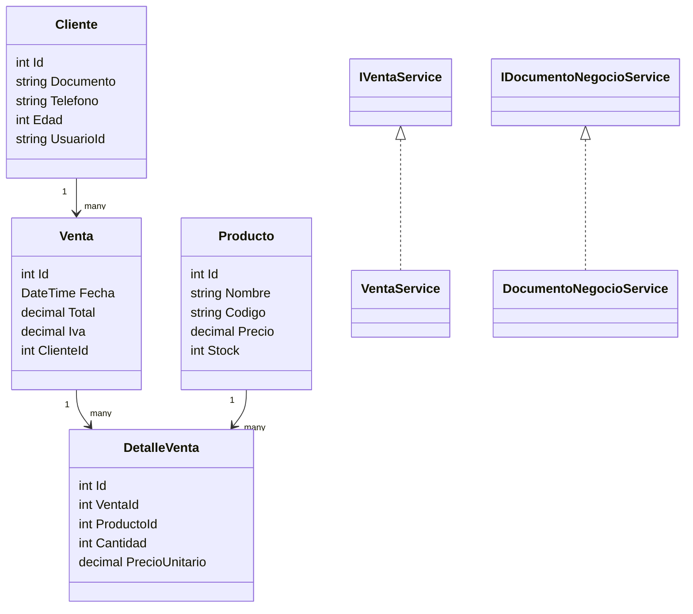

# Diagrama de Clases

```mermaid
classDiagram
    class Producto {
      int Id
      string Nombre
      string Codigo
      decimal Precio
      int Stock
    }

    class Cliente {
      int Id
      string Documento
      string Telefono
      int Edad
      string UsuarioId
    }

    class Venta {
      int Id
      DateTime Fecha
      decimal Total
      decimal Iva
      int ClienteId
    }

    class DetalleVenta {
      int Id
      int VentaId
      int ProductoId
      int Cantidad
      decimal PrecioUnitario
    }

    class IVentaService
    class IDocumentoNegocioService
    class VentaService
    class DocumentoNegocioService

    IVentaService <|.. VentaService
    IDocumentoNegocioService <|.. DocumentoNegocioService
    Venta "1" --> "many" DetalleVenta
    Cliente "1" --> "many" Venta
    Producto "1" --> "many" DetalleVenta
```
