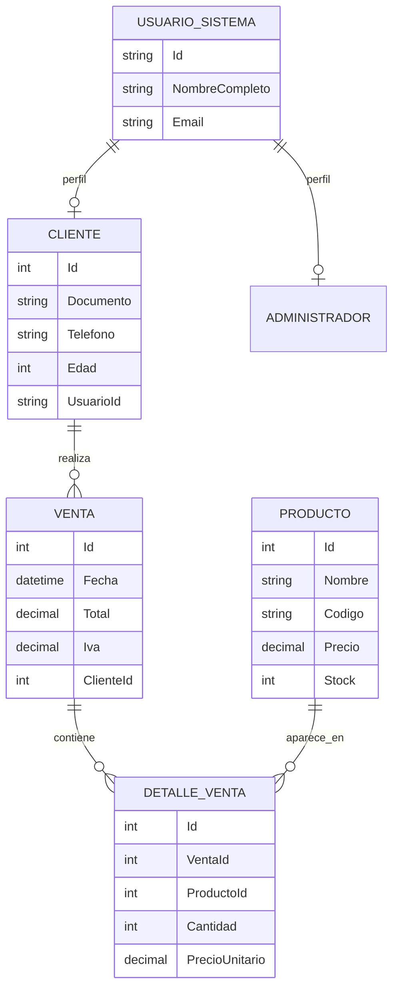

# Modelo Entidad-Relación

```mermaid
erDiagram
    USUARIO_SISTEMA ||--o| CLIENTE : "perfil"
    USUARIO_SISTEMA ||--o| ADMINISTRADOR : "perfil"
    CLIENTE ||--o{ VENTA : realiza
    VENTA ||--o{ DETALLE_VENTA : contiene
    PRODUCTO ||--o{ DETALLE_VENTA : aparece_en

    USUARIO_SISTEMA {
        string Id
        string NombreCompleto
        string Email
    }

    CLIENTE {
        int Id
        string Documento
        string Telefono
        int Edad
        string UsuarioId
    }

    PRODUCTO {
        int Id
        string Nombre
        string Codigo
        decimal Precio
        int Stock
    }

    VENTA {
        int Id
        datetime Fecha
        decimal Total
        decimal Iva
        int ClienteId
    }

    DETALLE_VENTA {
        int Id
        int VentaId
        int ProductoId
        int Cantidad
        decimal PrecioUnitario
    }
```
